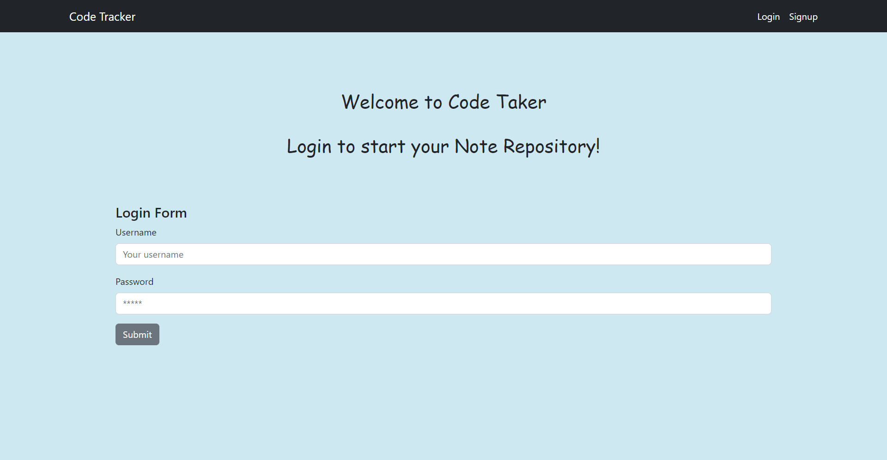

# Code Tracker

## Description
The application produces a repository that allows developers to store code snippets and/or links to their preferred code using notes. Our belief is that developers will find this beneficial as it helps them maintain their past preferred code in an organized manner and enables them to retrieve it quickly for future projects.

## Links

## Technology Used

Client - Server
React, Node.js, Express.js, GraphQL, MongoDB and Mongoose
React Bootstrap and Bootstrap
Apollo Server, JSON Web Token, bcrypt, among others; source of the framework
of the project and several templates: edX Boot Camps LLC

## Application Screenshot

## License
  
  
  
  
  
  [Read more about MIT License here.](https://opensource.org/licenses/MIT)
  
  
## Contributors
  
- Miklos Petronia [Github](https://github.com/miklos-petronia)
- David Restivo [Github](https://github.com/davidrestivo)
- James Chang  [Github](https://github.com/jamscc)
-  Samuel Villafana [Github](https://github.com/samvillafana)

  
  
  
  

